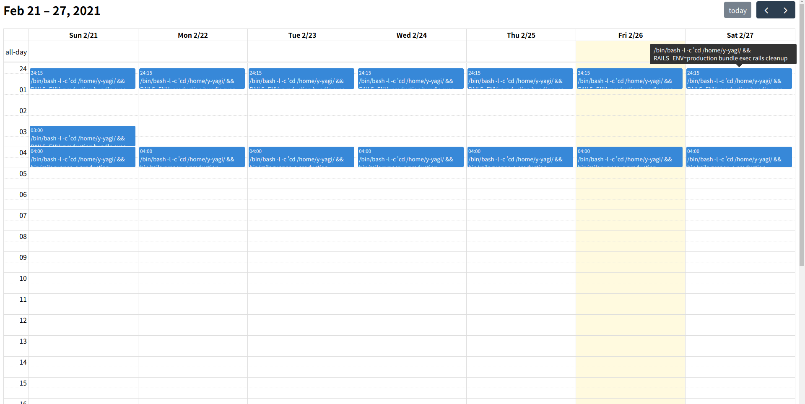

# croncal

`croncal` shows crontab list to calendar. `croncal` uses [FullCalendar](https://fullcalendar.io/) to show.

# How to use

You can specify a crontab list and `croncal` generate an HTML file.

```bash
$ crontab -l | croncal
Generate 'index.html'.
```



By default, cron list is showed for one week. You can change the duration to one month.

```bash
$ crontab -l | croncal -d month
```

# Install

Please download binaries via [GitHub Tags](https://github.com/y-yagi/croncal/tags).
